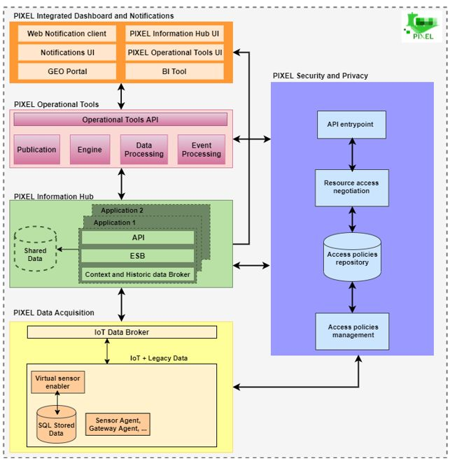

# PIXEL Documentation Page 

---

## Overview

This is the documents hub for the PIXEL project (https://pixel-ports.eu/). 

PIXEL is the first smart, flexible and scalable solution for reducing environmental impacts while enabling the optimization of operations in port ecosystems through IoT.

PIXEL enables a two-way collaboration of ports, multimodal transport agents and cities for optimal use of internal and external resources, sustainable economic growth and environmental impact mitigation, towards the Ports of the Future. Built on top of the state-of-the art interoperability technologies, PIXEL centralises data from the different information silos where internal and external stakeholders store their operational information. PIXEL leverages an IoT based communication infrastructure to voluntarily exchange data among ports and stakeholders to achieve an efficient use of resources in ports.

PIXEL has been financed by the Horizon 2020 initiative of the European Commission, contract 769355  

  

## Main Concepts and Architecture

The PIXEL platform aims at covering various challenges and facilitating operations at ports. Heterogeneous data including IoT sensors must be gathered and exchanged across different stakeholders operating at ports. Typically these data are difficult to handle due to a lack of homogenization and tools to operate them. 
By using (extended) FIWARE data models, PIXEL brings clarity, homogeneity and common semantics to such data. Furthermore, these data are also treated and exploited by means of specific models and predictive algorithms (e.g. energy, pollution, traffic, etc.) which help defining environmental and operational KPIs at ports. Last but not least, data access and treatment is presented through a powerful user-friendly dashboard to port operators (and eventually other port stakeholders).

The PIXEL architecture is divided into several building blocks to cover a wide range of needs for small, medium and large ports. The approach is data-centric so that multiple stakeholders and applications can homogeneously access to the data and provide added value services on top of them. 

 

  

## Data Models

The PIXEL Data Models are based on FIWARE data models, which have been harmonized to enable data portability for different applications including, Smart Cities, Smart Agrifood, Smart Environment, Smart Sensoring, Smart Enery, Smart Water and others domains. The PIXEL application domain refers to ports and port operations but we will follow and extend the FIWARE data model methodology.

   - Check more information about [FIWARE Data Models](https://www.fiware.org/developers/data-models/). It also has a [ReadTheDocs](https://fiware-datamodels.readthedocs.io/en/latest/) documentation repository.
   - Check some [PIXEL data models](https://pixel-ports.eu/) (TODO)
  

## Models

Ports activities undeniably have an impact on their environment, the city and citizens living nearby. To have a better understanding of these impacts, the ports of the future will require tools allowing suitable modelling, simulation and data analysis. Based on the reality of port activities and available data, the PIXEL platform provides variousmodels as useful tools. This will help them to have a better understanding of their environmental impacts. These models are focused on: 

  - Modelling of the supply chain and port’s activities (type of machine, duration of use, position in the port) to enable us to build activity scenarios that are used to identify the energy sources, local emissions of pollutants but also to estimate the flow of cargoes entering or leaving the port. Check the [latest documentation](https://pixel-ports.eu/) with tutorials and code access (TODO).
  - Modelling of consumption and energy production of the port with the aim of moving towards green energy production. For operational actors in ports, energy efficiency is an important issue, both from the environmental and economic perspectives. In order to optimize the energy flows inside the port, a prerequisite is to manage and quantify energy consumption and production in the context of complex industrial processes. Check the [latest documentation](https://pixel-ports.eu/) with tutorials and code access (TODO).
  - Modelling of congestion of multi-modal transport networks to reduce the impact of port traffic on the network. The model will help to understand if a different traffic management has a positive impact on congestions issues, citizens risk on the road and environmental impacts. Check the [latest documentation](https://pixel-ports.eu/) with tutorials and code access (TODO).
   - Modelling of environmental pollution of the port to reduce the environmental impacts of the port on the city and its citizens. These simulations can assist the port manager/operator in the decision-making process in order to optimize various activities within the port and minimize their impact on the environment. Check the [latest documentation](https://pixel-ports.eu/) with tutorials and code access (TODO). 

## Predictive Algorithms (PAs)

The PIXEL predictive algorithms are able to make future predictions for port traffic, vessel arrivals, etc. 

  - Check [PAs latest documentation](https://inter-iot.readthedocs.io/projects/intermeth/en/latest/)

## Data Acquistion Layer (DAL)

The DAL allows accessing data from heterogeneous sources (sensors, services, open data) 

  - Check [DAL latest documentation](https://inter-iot.readthedocs.io/projects/intermeth/en/latest/)

## Information Hub (IH)   

The IH is the central repository of data (latest and historical) 

  - Check [IH latest documentation](https://inter-iot.readthedocs.io/projects/interapi/en/latest/)

 
##  Operational Tools (OTs)

The OT are able to run the models and predictive algorithms deployed in the PIXEL platform 

  - Check [OT latest documentation](https://docs-hub-ot.readthedocs.io/)  
 
 
  
## Dashboard and Notification (DN)

The DN is the user interface for port operators/stakeholders to build their own dashborad and notifications  

  - Check [DN latest documentation](https://inter-iot.readthedocs.io/projects/gateway/en/latest/)

## Security and Privacy (S&P)

The S&P is a cross-layer module intended to provide security to the whole platform  

  - Check [S&P latest documentation](https://inter-iot.readthedocs.io/projects/gateway/en/latest/)

  

 
